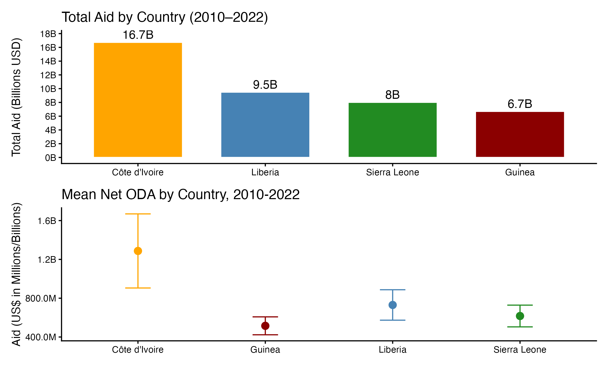
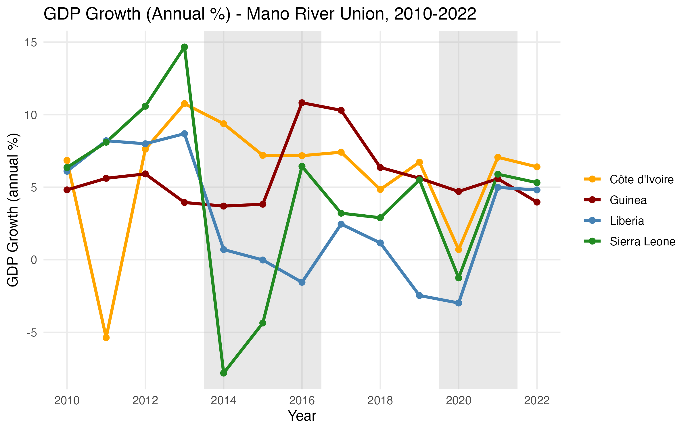

# Abstract

This study examines the influence of foreign aid on economic growth in
the four Mano River Union (MRU) countries: Liberia, Sierra Leone,
Guinea, and Côte d’Ivoire, spanning the years from 2010 to 2022. Using
panel data sourced from the World Bank’s World Development Indicators
(WDIs), the research aims to determine whether net official development
assistance (ODA) contributes to sustained economic growth or primarily
serves as a countercyclical measure to stabilize fragile economies.

The analysis utilizes pooled ordinary least squares (OLS), fixed effects
(FE), and random effects (RE) models to evaluate both cross-country and
within-country dynamics. Descriptive findings indicate that aid inflows
surged during crises, such as the Ebola epidemic (2014-2016) and the
COVID-19 pandemic (2020-2021), providing necessary fiscal relief;
however, there is limited evidence of a long-term impact on growth.

The FE estimation accounts for approximately 59 per cent of the
variation in GDP growth, suggesting that domestic structural and
institutional factors play a significant role in determining economic
performance. Côte d’Ivoire and Guinea exhibit the strongest growth
patterns, supported by effective policy reforms and export
diversification. In contrast, Liberia’s moderate progress highlights the
importance of targeted post-conflict support.

Overall, the results indicate that aid in the MRU region primarily
serves a stabilizing function rather than inducing growth. To enhance
the effectiveness of aid and foster sustainable and inclusive economic
transformation, it is essential to strengthen fiscal management,
institutional capacity, and regional integration.

# Background

The MRU was established in 1973 through a treaty between Liberia and
Sierra Leone. It later expanded to include Guinea in 1980 and Côte
d’Ivoire in 2008. The primary purpose of the Union is to promote peace,
security, and economic cooperation among its member states **([Mano
River Union Secretariat, 2023](https://www.mru.int/overview-history))**.
Despite differing post-independence paths, these countries share several
structural characteristics, such as fragile economies, a young and
rapidly growing population, and a high dependence on agriculture and
natural resource exports.

The MRU countries have faced recurrent shocks that have hindered
sustained economic growth and poverty reduction. Prolonged civil
conflicts in Liberia, Sierra Leone, and Côte d’Ivoire, along with
political instability in Guinea, have eroded the state’s capacity and
weakened its infrastructure. These challenges were further compounded by
the Ebola virus epidemic from 2014 to 2016, which originated in Guinea
and spread to Liberia and Sierra Leone, resulting in thousands of deaths
and significant economic losses. According to the World Bank (2016), the
outbreak caused GDP growth in the most affected countries to decline by
over 50 percent during the crisis years. More recently, the COVID-19
pandemic has strained health systems and fiscal stability, highlighting
the region’s vulnerability to external shocks.

Economically, all four MRU nations heavily rely on primary commodities,
notably iron ore, cocoa, rubber, and gold, making them susceptible to
fluctuations in global prices. The informal sector accounts for the
majority of employment, while formal job creation and industrial
diversification are limited. Consequently, poverty rates in the region
remain among the highest in Sub-Saharan Africa. In 2022, the World Bank
estimated that national poverty headcounts exceeded 40 percent in
Liberia, Sierra Leone, and Guinea. These structural constraints
emphasize the importance of sustained investment and external financing
to achieve the MRU’s development goals of inclusive growth, regional
trade, and social resilience **([World Bank,
2022](https://datatopics.worldbank.org/world-development-indicators/themes/poverty-and-inequality.html),
[African Development Bank/AfDB,
2023](https://www.afdb.org/sites/default/files/documents/publications/afdb23-01_aeo_main_english_0602.pdf))**.

# Development Assistance in the Mano River Countries

Development assistance has been a vital component of national
reconstruction and economic stabilization in the MRU region,
particularly given the challenges it faces. After years of conflict and
limited domestic revenue, external aid has funded essential
infrastructure, governance reforms, and social programs. In particular,
ODA, defined by the Organization for Economic Co-operation and
Development (OECD) as concessional financial flows from donor
governments to developing countries, continues to play a significant
role in public financing within the MRU **([OECD,
2023](https://www.oecd.org/en/events/2025/01/official-development-assistance-oda-2023-final-figures.html))**.

Between 2010 and 2022, MRU countries received substantial net ODA
disbursements that addressed both humanitarian and development needs.
For example, donor inflows increased during the Ebola crisis, as
international partners, including the World Bank, USAID, the African
Development Bank (AfDB), and the European Union, financed emergency
responses and recovery programs following the epidemic (World Bank,
2017). Similarly, Côte d’Ivoire received considerable aid support after
its 2010–2011 post-electoral crisis, which helped rebuild infrastructure
and restore macroeconomic stability **([IMF,
2021](https://www.elibrary.imf.org/view/journals/002/2021/170/002.2021.issue-170-en.xml))**.

Therefore, there is an urgent need to empirically investigate the
relationship between Net ODA and GDP growth (annual per cent) across the
four MRU countries during the period from 2010 to 2022. Understanding
whether and to what extent aid inflows contribute to economic expansion
will provide valuable insights into the effectiveness and sustainability
of aid-dependent growth models in post-conflict and low-income contexts.

# Assessing the Impact of Aid on GDP: Significance of the Study

Assessing the impact of development assistance on GDP growth in the MRU
countries is important for several reasons. First, understanding the
magnitude and direction of aid’s effects on economic performance
provides valuable insights for optimizing donor engagement and national
planning. Given the region’s high dependence on aid, it is crucial to
determine whether ODA contributes to real growth or merely offsets
budget deficits, ensuring sustainable fiscal management.

Second, this study generates comparative insights across four countries
that share similar economic and institutional characteristics but differ
in their capacity to absorb aid and the quality of governance. By
analyzing the period from 2010 to 2022, a decade marked by events such
as the Ebola outbreak, commodity shocks, and the COVID-19 pandemic, this
research captures both crisis and recovery phases, revealing how aid
flows interact with cyclical growth patterns.

Finally, the findings provide valuable information for regional and
international stakeholders, including the MRU Secretariat, ECOWAS, the
AfDB, and bilateral donors. This will help align external assistance
with domestic growth strategies. Evidence-based conclusions from this
study can guide resource allocation, enhance transparency, and
strengthen policy coherence within the MRU framework. In summary, this
research contributes to the broader discussion on aid effectiveness in
low-income, post-conflict economies, offering practical implications for
achieving inclusive and resilient growth in West Africa.

# Methodology

This study uses a quantitative, panel-data research design to
empirically assess the relationship between Net ODA and economic growth
(measured as GDP growth percentage) in the four MRU countries from 2010
to 2022. The data is primarily sourced from the WDIs database, which
ensures cross-country comparability and temporal consistency.

The panel structure allows for the analysis of both cross-sectional and
temporal variations, capturing country-specific differences and yearly
fluctuations. The econometric analysis begins with OLS as the baseline
method, followed by FE and RE estimations. The FE model controls for
unobserved, time-invariant country characteristics, such as geography,
culture, and long-term institutional capacity, which could influence
both aid and growth by isolating the impact of aid inflows on growth,
accounting for structural differences between countries **([Wooldridge,
2010](https://ipcid.org/evaluation/apoio/Wooldridge%20-%20Cross-section%20and%20Panel%20Data.pdf))**.
In contrast, the RE model assumes that these unobserved factors are
random and uncorrelated with the explanatory variables.

Overall, these models provide a thorough examination of how external
assistance interacts with domestic economic dynamics over time and
across countries, offering policy-relevant insights into the
effectiveness and sustainability of aid-driven growth within the MRU
region.

# Descriptive Analysis of Aid Flows (2010-2022)

Between 2010 to 2022, MRU countries experienced significant inflows of
development assistance and varying economic performance **([World Bank,
2023](https://openknowledge.worldbank.org/server/api/core/bitstreams/2106db86-a217-4f8f-81f2-7397feb83c1f/content))**.
These nations share similar post-conflict histories and face common
development challenges, including fragile institutions, high poverty
rates, and a reliance on external aid to support public investments and
social programs **([African Development Bank/AfDB,
2023](https://www.afdb.org/sites/default/files/documents/publications/afdb23-01_aeo_main_english_0602.pdf))**.
During this period, the MRU region received a substantial amount of Net
ODA to rebuild infrastructure, enhance governance, and respond to
recurring crises. Notably, there were sharp surges in aid during major
shocks, particularly the Ebola epidemic (2014-2016) and the COVID-19
pandemic (2020-2021), highlighting the countercyclical role of foreign
aid in stabilizing fragile economies. Furthermore, the period was
characterized by fluctuating economic growth, alternating between
periods of expansion, contraction, and partial recovery as the region
navigated post-war reconstruction, health emergencies, and global market
disruptions.

Aid disbursements across the twelve-year span were unevenly distributed,
with Côte d’Ivoire receiving the largest cumulative share. Between 2010
and 2022, Côte d’Ivoire attracted approximately **\$16.7 billion**,
which constituted a significant portion of total MRU aid. This influx
reflected the country’s successful post-conflict recovery, macroeconomic
reforms, and strong institutional capacity to manage external funds.
Liberia, emerging from a prolonged civil conflict, received about
**\$9.5 billion** in aid, primarily for reconstruction and
health-related support, especially during the Ebola outbreak. Sierra
Leone followed with an estimated **\$8 billion**, which was used for
extensive post-war and post-Ebola recovery financing, while Guinea
received approximately **\$6.7 billion**, the smallest total among the
four countries. Average annual aid inflows were highest in Côte d’Ivoire
(about **\$1.2 to \$1.3 billion** per year) and lowest in Guinea (around
**\$0.5 billion** per year). Visual analyses indicated clear spikes in
aid during crisis periods, notably in 2012-2013 for Côte d’Ivoire’s
post-electoral reconstruction, from 2014 to 2016 for Ebola emergency
funding across Liberia, Sierra Leone, and Guinea, and again in 2020-2021
for COVID-19 pandemic relief. These patterns illustrate that aid to the
MRU region is not steady or predictable; rather, it is heavily
responsive to crises, with major donors reallocating funds based on
humanitarian and health priorities.

Economic performance during the same period displayed similar
volatility, underscoring the region’s vulnerability to both internal and
external shocks. All four MRU economies underwent three distinct phases,
as indicated by their GDP growth trends. The first phase (2010-2013) was
characterized by robust post-war and post-crisis expansion. The second
phase (2014-2016) coincided with the Ebola epidemic, which had a severe
impact on economic activity across the region. The third phase
(2017-2022) featured an uneven recovery, which was again interrupted by
the COVID-19 pandemic. Côte d’Ivoire maintained the strongest and most
consistent growth trajectory, averaging **7-8 per cent** annually,
thanks to its diversified export base and political stabilization after
2011. Liberia exhibited significant fluctuations, demonstrating strong
early growth followed by a sharp contraction from 2014-2015, as the
Ebola outbreak disrupted production and trade. However, while Liberia’s
economic growth gradually recovered after 2017, it was again negatively
affected during the COVID-19 period. Sierra Leone experienced dramatic
economic fluctuations, including a remarkable **20 per cent** expansion
in 2013, driven by iron ore production, followed by a nearly **20 per
cent** decline in 2015 due to the combined effects of the Ebola outbreak
and a drop in commodity prices **([(World Bank,
2019](https://openknowledge.worldbank.org/entities/publication/351c4455-8344-529c-8491-92177b873e55))**.
Although Guinea received less aid overall, it displayed steady and
moderate growth of **4-6 per cent** per year, supported by continuous
investment in mining and energy projects, even during crisis years.

A closer examination of both aid and GDP patterns reveals important
co-movements between the two variables. In years of crisis, particularly
during 2014-2016 and 2020-2021, foreign aid inflows surged as GDP growth
sharply declined, suggesting that development assistance played a
stabilizing and compensatory role in offsetting economic disruptions.
The timing of these spikes and troughs indicates aid’s countercyclical
nature: when economic output contracted, donor disbursements increased
to provide fiscal relief and sustain social spending **([African
Development Bank/AfDB,
2023](https://www.afdb.org/sites/default/files/documents/publications/afdb23-01_aeo_main_english_0602.pdf))**.
However, while aid effectively mitigated short-term economic collapses,
its influence on long-term growth trajectories appears inconsistent.
Côte d’Ivoire’s sustained growth, even amid fluctuations in aid,
indicates that internal policy and structural reforms are as crucial as
donor inflows. Conversely, Liberia and Sierra Leone show signs that high
aid volumes during crises were followed by slow and incomplete
recoveries, highlighting their limited capacity to absorb aid and
structural dependence on external resources. Guinea’s more modest but
stable growth suggests resilience despite receiving less aid,
emphasizing the importance of internal investment and governance
strategies.

# Fixed Effects Analysis: Impact of Aid on Economic Growth (2010-2022)

$Y_{it} = \beta_1\cdot X_{it} + \alpha_i + e$

$GDP_{it} = \beta_1\cdot Aid_{it} + a_i\cdot country + e$

The fixed effects estimation investigates the relationship between net
ODA and GDP growth within the four MRU countries from 2010 to 2022. This
model controls for unobserved heterogeneity that could skew
cross-sectional analyses, such as differences in governance quality,
infrastructure, or geography, by allowing each country to have its own
intercept or baseline. By doing so, the model focuses on how
year-to-year changes in aid inflows within a country correspond to
changes in its economic growth, holding constant all country-specific,
time-invariant factors. This approach provides a clearer understanding
of whether fluctuations in aid are associated with measurable short-term
growth effects in fragile, aid-dependent economies.

The analysis results indicate that the connection between aid and
economic growth is weak. In every version of the model, the estimated
effect of aid on growth is slightly negative but too small to be
considered statistically significant. This means that between 2010 and
2022, changes in the amount of aid received by a country did not lead to
clear increases or decreases in its annual economic growth. In simpler
terms, while aid levels fluctuated over time, often in response to
crises such as the Ebola outbreak or the COVID-19 pandemic, these shifts
did not directly result in faster or slower growth. This finding aligns
with previous research, which shows that in fragile or post-conflict
countries, foreign aid often serves a more stabilizing or humanitarian
role rather than acting as a direct engine of economic expansion
**([Burnside & Dollar,
2000](https://www.aeaweb.org/articles?id=10.1257/aer.90.4.847);
[Easterly,
2003](https://www.aeaweb.org/articles?id=10.1257/089533003769204344);
[Clemens et al.,
2012](https://doi.org/10.1111/j.1468-0297.2011.02482.x))**

A closer examination of individual countries reveals significant
differences in their overall growth performance. Côte d’Ivoire exhibited
the strongest results, with an average annual growth rate of
approximately **8.9 per cent** over the study period. This reflects the
country’s successful recovery from conflict, steady economic reforms,
and diversified export industries that supported rapid growth. Guinea
also performed well, with an average growth rate of around **7.0 per
cent**, driven by its expanding mining and energy sectors, which helped
maintain moderate progress even during global or regional crises. Sierra
Leone experienced a similar trend, with an estimated growth advantage of
approximately **5.7 per cent**, indicating continued post-Ebola
reconstruction and investment in public infrastructure. Liberia, while
still showing positive growth, displayed a smaller growth advantage of
approximately **4.7 per cent**, reflecting moderate economic progress
but continued vulnerability to aid dependence and external shocks.

<figure>

<figcaption aria-hidden="true">Aid Impact on GDP Growth</figcaption>
</figure>

The fitted-value plot of predicted GDP growth against net aid visually
confirms these relationships. The distribution of points shows that
changes in aid (measured in millions and billions of US dollars) do not
correlate with proportional changes in GDP growth. Côte d’Ivoire’s data
points cluster toward higher aid and higher predicted growth, while
those for Liberia and Sierra Leone are positioned lower, reflecting
weaker economic performance despite similar aid inflows. Guinea’s points
are more centered, consistent with its moderate but steady growth
pattern. The overall flat slope of the fitted relationship suggests
that, once unobserved country-specific effects are controlled for, aid
inflows have a negligible marginal effect on growth.

Overall, the estimation suggests that net ODA in the MRU region between
2010 and 2022 played a countercyclical and stabilizing role rather than
directly driving economic growth. Aid inflows typically increase during
crisis periods, such as the Ebola epidemic (2014-2016) and the COVID-19
pandemic (2020-2021), helping to cushion economic downturns without
significantly accelerating recovery. Côte d’Ivoire’s consistently high
growth, despite fluctuating aid, highlights the importance of domestic
reforms, macroeconomic stability, and export diversification in
sustaining long-term performance. Similarly, Liberia’s positive growth
trajectory reflects moderate progress despite its dependence on aid and
structural fragility, suggesting that targeted assistance and improved
fiscal coordination have contributed to gradual post-conflict recovery
and resilience.

# Discussion and Recommendations

This study demonstrates that foreign aid has played a crucial role in
stabilizing the economies of the MRU, but it has not consistently led to
sustained economic growth. This means that while development assistance
remains crucial for macroeconomic stability and crisis mitigation, its
ability to generate sustained growth depends on the presence of strong
institutions, efficient public investment mechanisms, and economic
diversification. From 2010 to 2022, ODA primarily served as a
countercyclical tool, increasing sharply during crises such as the Ebola
epidemic and the COVID-19 pandemic. This assistance aimed to cushion
economic shocks and maintain public spending. However, the econometric
analysis showed that the link between aid inflows and GDP growth is weak
and statistically insignificant. This suggests that while aid may
alleviate short-term downturns, it does not necessarily promote
long-term development.

Country-level results reveal significant contrasts within the MRU
region. Côte d’Ivoire’s robust and sustained growth is attributed to
structural reforms, macroeconomic discipline, and export
diversification. Guinea’s positive trajectory highlights the benefits of
resource-based investments and gradual enhancements in institutional
strength. In contrast, Liberia and Sierra Leone illustrate the
limitations of aid-driven recovery without deeper structural changes.
The findings confirm that the effectiveness of aid heavily depends on
each country’s governance quality, absorptive capacity, and policy
coherence.

To improve aid effectiveness and foster resilience, MRU governments and
development partners should aim to strengthen fiscal transparency,
enhance investment efficiency, and align aid programs with national
development priorities. Regional coordination through the MRU
Secretariat, ECOWAS, and the AfDB can further facilitate shared
learning, harmonized policies, and sustainable growth strategies. By
prioritizing institutional capacity-building, diversification, and
results-based planning, the MRU countries can transform external
assistance into a catalyst for inclusive and lasting economic progress.

