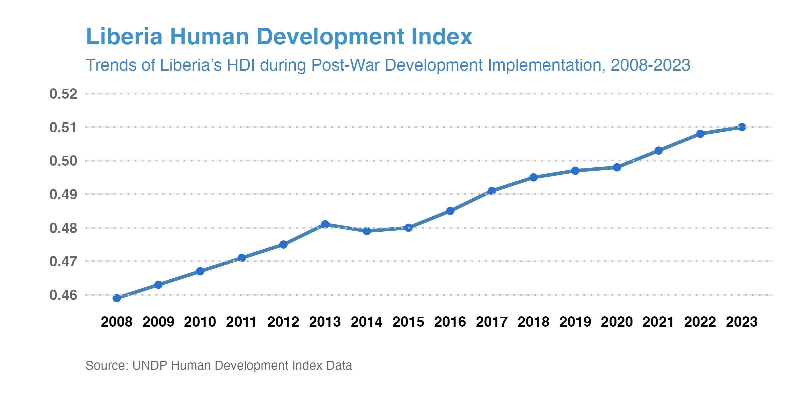
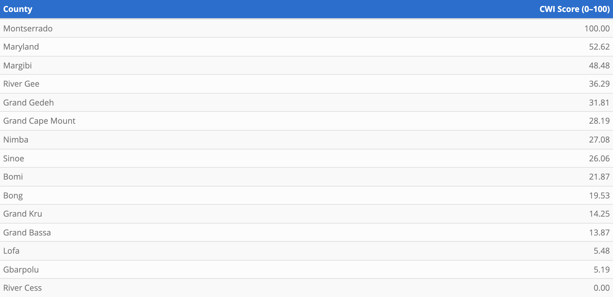
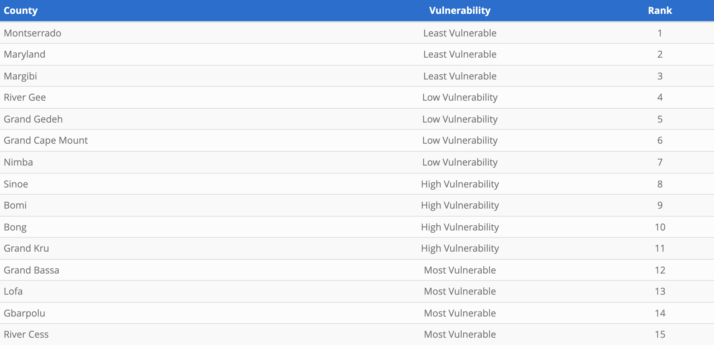

<!-- FULL-BLEED COVER PHOTO -->
<section
  class="relative w-screen max-w-none overflow-hidden left-1/2 right-1/2 -ml-[50vw] -mr-[50vw]"
>
  
</section>

# Evaluating Post-War Development Outcomes in Liberia: A County-Level Analysis Using Community Well-Being and Human Development Indexes (2008-2023)

**Haven Yarl**

## Background

Liberia’s development trajectory was profoundly shaped by its 14-year civil conflict (1989–2003), which devastated the nation’s economy, infrastructure, and human capital. Before the war, Liberia had made modest progress in sectors such as agriculture, mining, and education; however, by the end of the conflict, the country’s socioeconomic foundations had almost entirely collapsed. The long civil conflict resulted in the deaths of an estimated 150,000 to 250,000 people and displaced over half of the population, both internally and across borders [(Center for Justice and Accountability)](https://cja.org/where-we-work/liberia/). The nation’s economy experienced a near-total collapse during the civil conflict, with GDP per capita declining by more than 80 percent between 1980 and the early 2000s, making Liberia one of the world’s poorest countries [(World Bank, 2023)](https://data.worldbank.org/country/liberia).

The conflict’s impact on infrastructure and public services was equally catastrophic. The World Bank reported that Liberia’s national power grid and water systems were completely destroyed during the war years, leaving most communities without electricity, clean water, or sanitation [(World Bank, 2004)](https://documents.worldbank.org/en/publication/documents-reports/documentdetail/765241468010485183/liberias-infrastructure-a-continental-perspective). Basic social services nearly vanished, and the health system disintegrated, with hospitals and clinics looted or burned. The education system suffered similar setbacks: thousands of schools were destroyed or abandoned, teachers fled the country, and an entire generation of children lost access to formal education [(UNDP, 2006)](https://hdr.undp.org/system/files/documents/liberia2006en.pdf).

Liberia’s labour market was severely weakened during and after the civil conflict, leaving much of the population dependent on precarious and low-productivity work. Even prior to the Ebola crisis, formal employment opportunities were extremely limited, and the overwhelming majority of workers relied on informal activities marked by low wages, unstable income, and high vulnerability [(Flomo et al., 2023)](https://doi.org/10.1002/jid.3736). Moreover, high rates of illiteracy, poverty, and poor health outcomes severely limiting citizens’ ability to rebuild their lives. Rebuilding infrastructure, restoring basic services, and re-establishing social stability became national imperatives. These conditions underscored the urgency for post-conflict development interventions [(UNDP, 2006)](https://hdr.undp.org/system/files/documents/liberia2006en.pdf). Furthermore, persistent inequalities between urban and rural counties, as well as between coastal and hinterland regions, made spatially targeted development strategies essential.

## Post-War Development Plans

In response to these challenges, post-war governments launched a series of national development plans aimed at rebuilding the economy and improving the well-being of its people. Each of these plans was supported by substantial inflows of development assistance from multilateral and bilateral partners.

The first major national response to this challenge was the Poverty Reduction Strategy (PRS, 2008-2011), which sought to transition Liberia from emergency recovery to sustainable development. The PRS articulated a vision of “rapid, inclusive, and sustainable growth” structured around four key pillars: peace and security, economic revitalization, governance and rule of law, and infrastructure and basic services [(IMF, 2008)](https://www.imf.org/external/pubs/ft/scr/2008/cr08219.pdf). The plan’s overarching goal was to reduce poverty through the reconstruction of critical infrastructure, including roads, electricity, and water systems, while simultaneously restoring health and education services. The PRS also aimed to re-establish government credibility and strengthen public financial management after years of institutional breakdown [(IMF, 2012)](https://doi.org/10.5089/9781463941055.002).

Building on the progress achieved under the PRS, the government launched the Agenda for Transformation (AfT, 2012-2017) as the second medium-term development framework. The AfT represented a deliberate shift from post-conflict recovery toward structural transformation and inclusive growth [(Republic of Liberia, 2013)](https://faolex.fao.org/docs/pdf/lbr169062.pdf); [(UNDP, 2013)](https://www.undp.org/liberia/publications/liberia-agenda-transformation). Although implementation was disrupted by the 2014–2016 Ebola epidemic, the plan nonetheless consolidated many of the recovery gains and continued to guide reform efforts in subsequent years [(World Bank, 2017)](https://documents1.worldbank.org/curated/en/585371528125859387/pdf/Liberia-From-growth-to-development-priorities-for-sustainably-reducing-poverty-and-achieving-middle-income-status-by-2030.pdf).

The Pro-Poor Agenda for Prosperity and Development (PAPD, 2018-2023), which succeeded the AfT, was designed to address persistent inequality and to ensure that economic growth translated into improved living conditions for all Liberians [(MFDP, 2018)](https://climate-laws.org/document/pro-poor-agenda-for-prosperity-and-development_85c1). Collectively, the PRS, AfT, and PAPD trace Liberia’s gradual evolution from reconstruction to transformation to inclusion.

## Liberia Post-War Development Challenges

Despite successive national development plans and significant inflows of international assistance, Liberia continues to face deep and persistent development challenges. Recent data underscore these disparities. According to LISGIS [(2023)](https://lisgis.gov.lr/), over half of the population continues to live below the national poverty line. Access to electricity remains below 30 percent nationwide, and only a minority of households have improved sanitation or potable water sources [(World Bank, 2023)](https://data.worldbank.org/country/liberia). Youth unemployment and underemployment remain acute [(AfDB, 2022)](https://www.afdb.org/en/countries/west-africa/liberia).

## Measuring Liberia Development Outcomes

This study evaluates Liberia’s post-war development performance using:

1. **Human Development Index (HDI)** (national level)
2. **Community Well-Being Index (CWI)** (county and regional level)

## Research Design and Methodology

This research utilized a hybrid longitudinal–cross-sectional design. HDI trends were assessed from 2008 to 2023 using UNDP national estimates [(UNDP, 2024)](https://hdr.undp.org/data-center/human-development-index#/indicies/HDI). The CWI was created using 2023 census-based indicators and PCA weighting [(Jolliffe & Cadima, 2016)](https://doi.org/10.1098/rsta.2015.0202).

## Analysis of Liberia’s Human Development Index (2008-2023)

Liberia’s HDI increased from 0.459 in 2008 to 0.510 in 2023, reflecting gradual improvements but remaining within the “low human development” category.

<figure>
  
  <figcaption aria-hidden="true">Human Development Trend (Liberia, 2008–2023)</figcaption>
</figure>

## Analysis of the County-Level Community Wellbeing Index (CWI)

<iframe align="center" width="1000" height="800" src="../../assets/cwi_pics/county_cwi.html"></iframe>

<iframe align="center" width="110%" height="700px" src="../../assets/cwi_pics/county_cat.html"></iframe>

## Analysis of the Regional-Level Community Wellbeing Index (CWI)

Regional patterns show South Central as least vulnerable, while North Central is most vulnerable, driven by persistently low county well-being outcomes.

  

